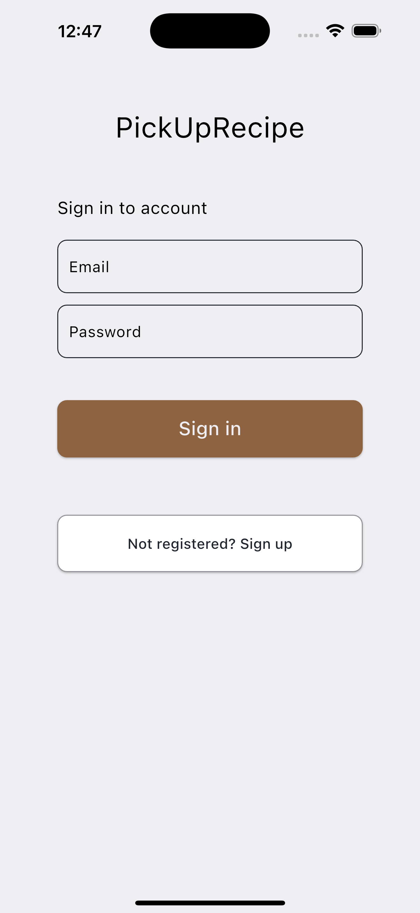
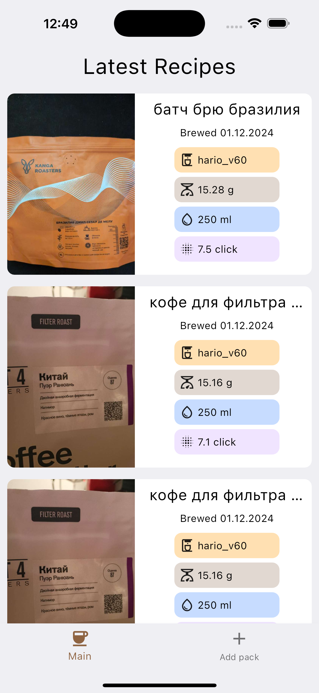
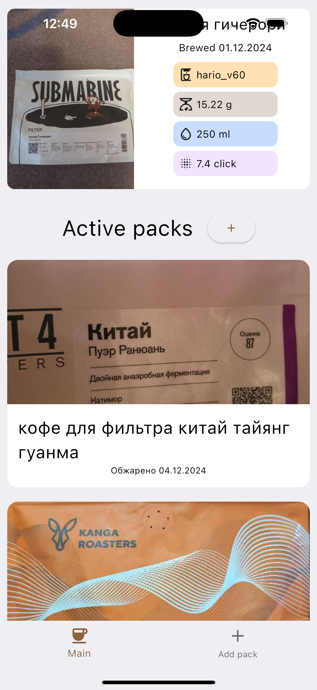
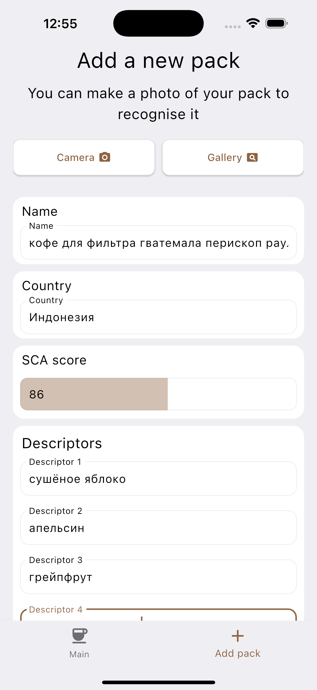
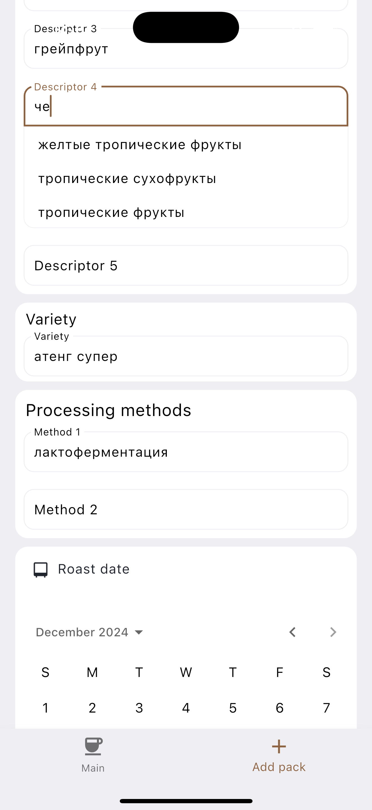
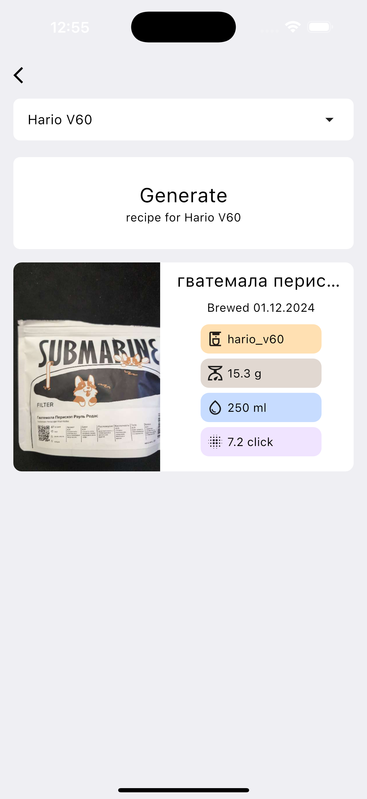
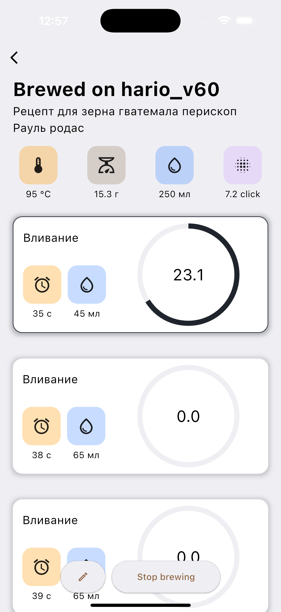

# PickUpRecipe

PickUpRecipe — это мобильное приложение, созданное для любителей кофе, которые заваривают напиток альтернативными методами. С его помощью вы легко подберете идеальный рецепт для своей пачки зерен, сэкономив время и избежав ошибок. Основное преимущество — использование технологий машинного обучения, что позволяет стабильно получать вкусную чашку кофе.

## 🌟 Основные функции

- Сканирование пачки кофе: Пользовавтель делает фотографию почки с кофе, после чего наша модель машинного обучения собирает с нее всю возможную информацию и пачка добавится в список активных пачек.

- Генерация рецепта: Для добавленной пачки можно перейти на ее страницу и выбрать любой из уже существующих для нее рецептов или сгенерировать новый.

- Выбор метода заваривания: Каждый рецепт сгенерирован под один из методов заваривания (например, hario v60). Его выбор осуществляется перед началом генерации рецепта.

- Встроенный brew-таймер: Каждый рецепт интегрирован с brew-таймером. Это позволяет заваривать кофе в реальном времени, строго следуя пошаговым инструкциям.

## 🛠 Установка

1. Убедитесь, что у вас установлены [Flutter](https://flutter.dev/) и [Dart](https://dart.dev/).

2. Перейдите в папку проекта:
    ```terminal
    cd pick_up_recipe
    ```
3. Установите зависимости:
    ```terminal
    flutter pub get
    ```
4. Запустите кодогенерацию:
    ```terminal
    dart run build_runner build 
    ``` 
5. Запустите приложение:
    ```terminal
    flutter run
    ```

## 📌 Используемые технологии

Приложение написано на [Flutter](https://flutter.dev/) - кроссплатформенном фреймворке для языка [Dart](https://dart.dev/). Это позволяет поддерживать сразу все целевые платформы (IOS и Android)

## 🚀 Что реализовано?

- Регистрация и авторизация
- Ввод информации с пачки кофе
- Сканирование информации о пачке кофе
- Добавление пачки кофе в личный кабинет
- Генерация рецепта заваривания альтернативными методами по пачке и устройству
- Просмотр сгенерированного рецепта в brew-таймере для удобного заваривания и минимизации ошибок
- Лента с последними заваренными рецептами

## 📷 Скриншоты

#### Страницы регристрации и авторизации
На этих страницах пользователи могут создать новый аккаунт или войти в существующий. Первый скриншот отображает страницу регистрации, второй — страницу авторизации.

<div style="display: flex; justify-content: space-around;">
  
  
</div>

#### Главная страница
На главной странице пользователь может выбрать один из уже сгенерированных для него рецептов или выбрать пачку для просмотра и создания рецептов именно для нее.

<div style="display: flex; justify-content: space-around;">
  
  
</div>

#### Станица для ввода и распознавания пачки 
На этой странице пользователь может сфотографировать или выбрать фото пачки кофе из галереи для распознавания, а затем вручную исправить или добавить данные о полях. Для текстовых полей реализованы подсказки, а для числовых — анимация, показывающая заполненность поля. Также для более удобного ввода даты используется календарь.

<div style="display: flex; justify-content: space-around;">
  
  
</div>


#### Страница пачки
На этой странице пользователь может просмотреть все рецепты, связанные с конкретной пачкой, а также создать новый рецепт для выбранного способа заваривания, выбрав его из выпадающего списка.

<div style="display: flex; justify-content: space-around;">
  
</div>

#### Brew таймер
Пользователь может следовать пошаговому процессу заваривания сгенерированного рецепта, а таймеры для каждого шага позволяют точно отслеживать время, значительно упрощая весь процесс.

<div style="display: flex; justify-content: space-around;">
  
</div>
<br><br><br>
Спасибо, что используете PickUpRecipe! Мы уверены, что с нами ваше кофейное путешествие станет ещё вкуснее и разнообразнее! ☕